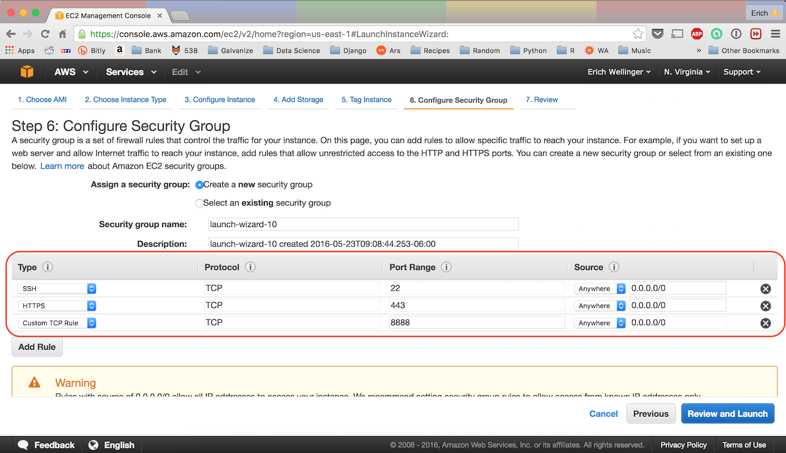

# Running Jupyter Notebook on AWS

The purpose of this script is to seamlessly create the configuration required for running a Jupyter Notebook (i.e. an iPython Notebook) on an AWS instance such that you can access it from anywhere.  The script will guide you through the process of creating a password for protecting access to your new server, issuing a certificate, creating a jupyter configuration file filled with the necessary information, launching a jupyter server in a `tmux` session, and finally printing out the URL to go to in your browser. **This script will need to be moved onto your instance in the home directory.**

For more information on the usage of the script type `./aws_jupyter_server -h` to print the help information as well as get a feel for what other options it accepts.

**NOTE**: When you run this script it will ask you for a password.  This is the password that you will input when logging into your server in a browser.

**NOTE**: This script only sets up the configuration details the first time it runs.  If it already sees that a password has been created, it will use it (similar to the certification and other details).  Thus the next time you run the script it will simply launch your server.  If you need to reset the configuration, run the script with the `-T` flag.  This will direct the script to wipe any previous configuration.

### Select An Instance Type
For the purposes of this guide we will launch from the `DSI-Template` (`ami-4be61326`) AMI.  This AMI comes preinstalled with Anaconda (Python 2.7), zsh, and several other add-ons, but you could just as easily start an Ubuntu instance from scratch and install Anaconda yourself (`tmux` is required to run this script so be sure to install that!)

### Security Settings
In order for this script to work properly and be able to access our instance through a web browser, we need to set up several specific security settings when launching our instance.  We need the following rules to be configured...
* `SSH` access from port 22.  
    * This is the default port for `ssh` connections and this rule will already be configured.  `ssh` allows us to actually interface with our new instance through a terminal shell.  
    * I would advise leaving this at port 22, but you could alter the port number and specify the new number when accessing your instance (you might do that for security reasons).  
    * We should also specify the source as `Anywhere` and `0.0.0.0/0`.  This says that our new instance should accept `ssh` requests from any IP address.  You could, for instance, specify that your new instance only accept requests from your home and work IP addresses which would improve the security of your instance.
* `HTTPS` from port 443
    * This is going to allow us to access our instance through a web browser with a secure connection.
* `Custom TCP Rule` from port 8888
    * This is going to specify what port we will put at the end of our URL when accessing our Jupyter Notebook after we get it running.
    * If we wanted to specify a different port, we would need to indicate that using the `-p` flag when running the `aws_jupyter_server` script (run `./aws_jupyter_server -h` for more information on using the script)

 

### Accessing Our Server
Now that our server is running on our instance we simply copy and paste the URL that was provided after running the previous script in our browser.  Once we go that that URL we get a warning that our connection is not private!  This is because Chrome doesn't recognize the certificate associated with the site and we wouldn't expect it to.  We just created it and it's not registered with any certification bodies.  Just click on `Advanced` and then click to proceed anyway.  You should be careful of doing this with sites you don't know the origin of, but seeing as we just created this ourselves it will be fine.

We now see a page prompting us for a password.  This will be the same password you set up when running the script earlier.

Any notebooks that you create will be saved to the `/home/ubuntu/ipython_notebooks` directory.
